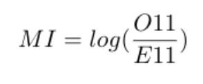
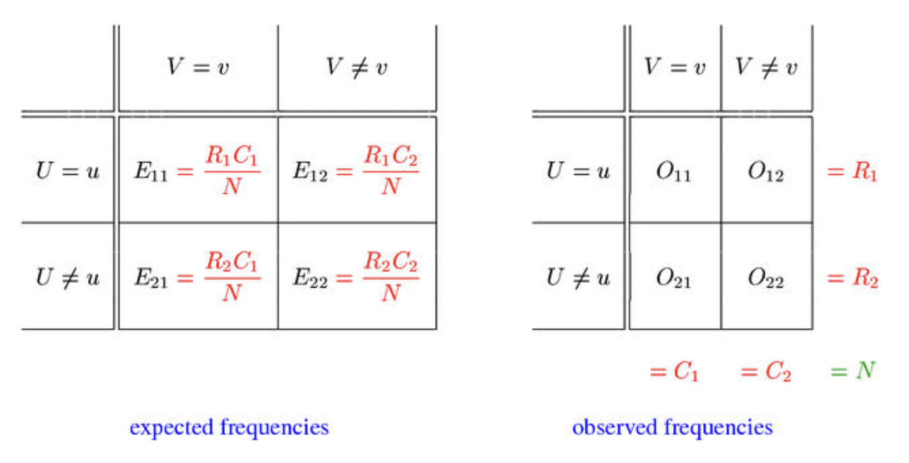

# Project 1: Collocates
This project was developed as a solution to assignment 2 set by our teacher, Ross Deans Kristensens-McLachlan, during the course. A Github repository which contains all of the code in relation to my solution to the assignment can be found here: 
https://github.com/frillecode/LanguageAnalytics2021/tree/main/src/project1

## Project description 
### String processing with Python
Using a text corpus found on the cds-language GitHub repo or a corpus of your own found on a site such as Kaggle, write a Python script which calculates collocates for a specific keyword.

- The script should take a directory of text files, a keyword, and a window size (number of words) as input parameters, and an output file called out/{filename}.csv  
- These parameters can be defined in the script itself  
- Find out how often each word collocates with the target across the corpus
- Use this to calculate mutual information between the target word and all collocates across the corpus
- Save result as a single file consisting of three columns: collocate, raw_frequency, MI


## Methods
For this project, I used a dataset consisting of a corpus of 100 English novels, covering the 19th and the beginning of the 20th century. I created a .py-script which takes this corpus, preprocesses the text (removes punctuation, etc.), and calculates collocates for a specific target word. To get a measure of the strength of the association between the target word and the collocates, I calculated the Mutual Information (MI) between them. Given a token pair _(u,v)_, where _u_ is the target word and _v_ is the collocate, MI is given by (Evert, 2014): 
<p align="center">
    
  <p>
 
<p align="center">
    
  <p>

The window size and target word can be specified through the command-line. If nothing is specified, the script will use the default values (target word: "father", window size: 2). The results are saved in the 'out/'-folder. In addition, the top 10 words with highest MI are printed to the command-line. For a more informative overview, I filtered away those words that only appear once in the corpus when printing the top 10. 

  
## Usage
The structure of the files belonging to this project is as follows:
```bash
LanguageAnalytics2021/  
├── data/ #data
│   └── project1/
│   │   └── 100_english_novels
│   │   │   └── corpus
│   │   │   │   └── *.txt
├── src/ #scripts
│   └── project1/
│   │   └── out/  #results
│   │   └── collocation.py   
├── utils/  #utility functions 
│   └── *.py  
```

### Cloning repo and installing dependencies 
To run the script, I recommend cloning this repository and installing relevant dependencies in a virtual environment:  

```bash
$ git clone https://github.com/frillecode/LanguageAnalytics2021
$ cd LanguageAnalytics2021
$ bash ./create_venv.sh #use create_venv_win.sh for windows
```

If you run into issues with some libraries/modules not being installed correctly when creating the virtual environment, install these manually by running the following:  
```bash
$ cd LanguageAnalytics2021
$ source cds-lang/bin/activate
$ pip install {module_name}
$ deactivate
```

### Running scripts
After updating the repo (see above), you can run the .py-files from the command-line by writing the following:
``` bash
$ cd LanguageAnalytics2021
$ source cds-lang/bin/activate
$ cd src/project1
$ python3 collocation.py
```

The script takes different optional arguments that can be specified through the command-line. For example, to run the script with the target word "dead" and a window size of 5, run: 
``` bash
$ python3 collcation.py -k "dead" -w 5
```


You can get more information on the optional arguments that can be parsed by running:
``` bash
$ python3 collocation.py --help
```

## Discussion of results
The resulting output-files from running the script can be found in 'out/'. The output file that is currently in the folder is from running the script with the default values, i.e. with the target word "father" and a window size of 2.

When filtering away those words that only appear once across the corpus, the top 10 words with highest MI-scores are: 
|Collocate|Raw frequency|MI-score|
|---|---|---|
|gervaise | 39 | 7.084478|
|consett | 11 | 7.059161 |
|banger | 3 | 7.059161 |
|beron | 14 | 7.059161 |
|corbelan | 40 | 6.836017 |
|benedict | 23 | 6.756880 |
|dennis | 114 | 6.704989 |
|predikant | 21 | 6.499545 |
|sups | 2 | 6.366013 |
|kafa | 2 | 6.366013 |

These are the words that are most strongly associated with the target word "father" when calculating MI-scores with a window size of 2.   

Several of the top words (e.g. "gervaise" and "dennis") seems to be names, which could make sense in the context of "father". Some of the words, I do not recognize. Here, it would be beneficial to consult with a literary historian to figure out whether it is because these words are outdated/historical phrases or whether there might be some issues with the preprocessing. 

Depending on research questions, different additional preprocessing steps can be performed when using a method like this. For example, one might want to research gender associations/stereotypes by investigating which adjectives co-occur with certain words such as "father" or "mother". For such a question, preprocessing steps could include removing names from the texts using Named Entity Recognition. 


## References
Evert, S., (2004), "Association Measures", http://collocations.de/AM/index.html, [Retrieved May 21 2021]


