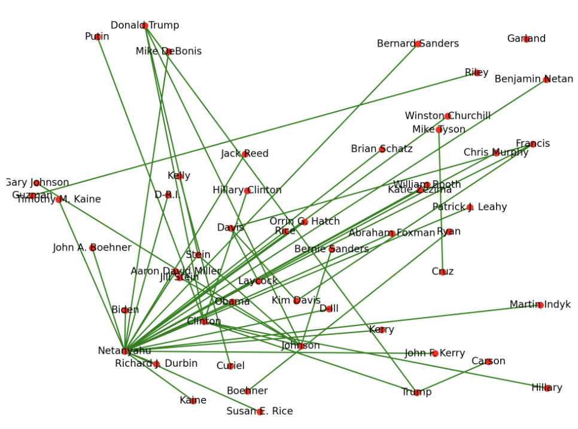
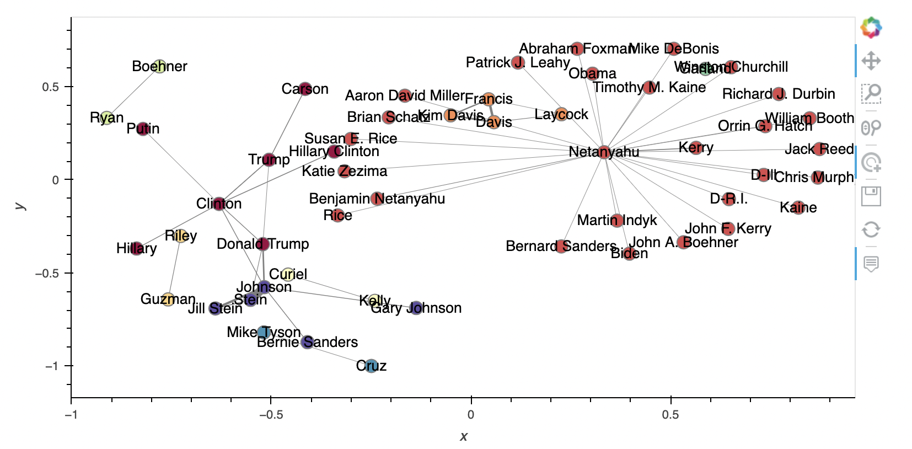
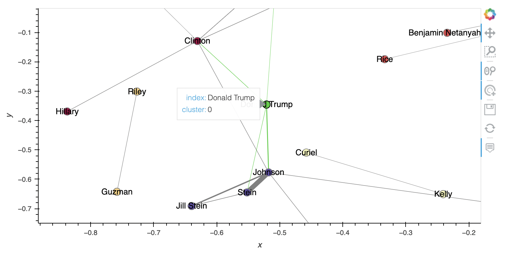
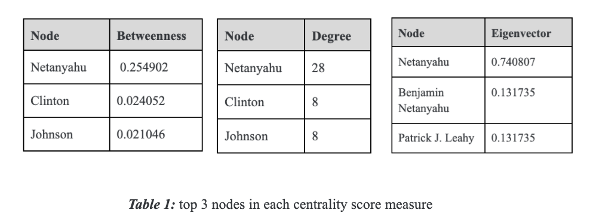

# Project 2: Network analysis
This project was developed as a solution to assignment 4 set by our teacher, Ross Deans Kristensens-McLachlan, during the course. A Github repository which contains all of the code in relation to my solution to the assignment can be found here: 
https://github.com/frillecode/LanguageAnalytics2021/tree/main/src/project2

## Project description 
### Creating reusable network analysis pipeline
This exercise is building directly on the work we did in class. I want you to take the code we developed together and in you groups and turn it into a reusable command-line tool. This command-line tool will take a given dataset and perform simple network analysis. In particular, it will build networks based on entities appearing together in the same documents, like we did in class.  

- Your script should be able to be run from the command line  
- It should take any weighted edgelist as an input, providing that edgelist is saved as a CSV with the column headers "nodeA", "nodeB"
- For any given weighted edgelist given as an input, your script should be used to create a network visualization, which will be saved in a folder called viz.
- It should also create a data frame showing the degree, betweenness, and eigenvector centrality for each node. It should save this as a CSV in a folder called output.

## Methods
This script takes a weighted edgelist with column names \"nodeA\", \"nodeB\", \"weight\" as input and 1) creates and saves network visualizations and 2) calculates and saves centrality scores for each node. To get an overview of the results, the top 5 nodes in each centrality score are printed to the command-line. It is possible to specify a cut-off value for which node pairs with edge weight lower than that are removed. This is recommended if the plot is too dense to interpret. 

The network analysis is done using the Python package [NetworkX](https://networkx.org/documentation/stable//reference/drawing.html). 

To provide better overview and interpretability, the script also creates an interactive plot of the network using [HoloViews](http://holoviews.org/user_guide/Network_Graphs.html). This plot allows you to zoom in and hover over nodes to see more detailed information. In this plot, the nodes are colored by communities/clusters calculated by best partition using the Louvain algorithm (Aynaud, 2009). The width of the edges are defined by the weight of the connection. 

To test the script, I used a weighted edgelist created by extracting entities appearing together in documents from a dataset consisting of news articles regarding the 2016 US Presedential Election. The dataset can be found here: https://www.kaggle.com/rchitic17/real-or-fake. The edgelist is based on the documents labelled as 'REAL' news. 

## Usage
The structure of the files belonging to this project is as follows:
```bash
LanguageAnalytics2021/  
├── data/ #data
│   └── project2/
│   │   └── weighted_edgelist_test.csv 
├── src/ #scripts
│   └── project2/
│   │   └── output/  #results
│   │   └── viz/  #results
│   │   └── network.py   
├── utils/  #utility functions 
│   └── *.py  
```

### Cloning repo and installing dependencies 
To run the script, I recommend cloning this repository and installing relevant dependencies in a virtual environment:  

```bash
$ git clone https://github.com/frillecode/LanguageAnalytics2021
$ cd LanguageAnalytics2021
$ bash ./create_venv.sh #use create_venv_win.sh for windows
```

If you run into issues with some libraries/modules not being installed correctly when creating the virtual environment, install these manually by running the following:  
```bash
$ cd LanguageAnalytics2021
$ source cds-lang/bin/activate
$ pip install {module_name}
$ deactivate
```

### Running scripts
After updating the repo (see above), you can run the .py-files from the command-line by writing the following:
``` bash
$ cd LanguageAnalytics2021
$ source cds-lang/bin/activate
$ cd src/project2
$ python3 sentiment.py
```

This script takes a weighted edgelist as an input and has the possibility of specifying a cut-off value for weights of node pairs to include in the analysis and visualization. I have provided a .csv-file with an edgelist in the correct format which can be used to run the script. This file is the default edgelist in the script. If you want to use another edgelist, this must be uploaded to the '../../data/project2/'-folder and the filename passed as an argument in the command-line. For example, to use a new edgelist and a cut-off value of 10 run:
``` bash
$ python3 network.py -we "{edgelist_filename}.csv" -c 10
```

You can get more information on the optional arguments that can be parsed by running:
``` bash
$ python3 network.py --help
```

## Discussion of results
After running the script, the network visualizations can be found in 'viz/' and the centrality measures in 'output/'. The files that are currently there are the results from runnning the script with the example weighted edgelist ("weighted_edgelist_test.csv") and a cut-off value of 15. As mentioned, this edgelist consists of entities appearing together in news articles regarding the 2016 US Presedential Election. 

The script creates two different network visualizations. The first one is a static image displaying the connections between entities: 

<p align="center">
    
  <p>
  
The second one is an interactive visualization where you can zoom in to get a better overview of the network. To use the interactive tools, open the 'viz/interactive.html' (e.g. in a browser). Here, I've included screenshots to show examples of what you can see in the visualization: 

<p align="center">
    
  <p>
<p align="center">
    
  <p>


Here, you see the top 3 nodes for each centrality score measure: 
<p align="center">
    
  <p>


From these results, we see that 'Netanyahu' is the entitiy with highest degree, betweenness, and eigenvector score - indicating that this might be an important note in terms of connecting other nodes. This corresponds to what we see on the interactive plot where there seems to be a cluster centered around 'Netanyahu' (colored in orange).

In addition, we see a cluster with 2016 US presedential candidates, 'Hillary Clinton' and 'Trump' and Russian president 'Putin' (colored in dark red). The plots shows the strongest connection (i.e. highest weight) to be between 'Johnson' and 'Stein' indicating that these entities often appear together in the analysed documents. Assuming the entities refer to Libertarian Party nominee Gary Johnson and Green Party's Jill Stein, this makes sense since many articles seem to mention these third-party candidates together in the context of the 2016 US election (Chalabi, 2016 ; Watkins, 2016). As seen by the plot, both also have connections with 'Trump' and 'Clinton'. 

Upon inspecting the results, a few concerns arise. For example, we see that 'Clinton', 'Hillary Clinton', and 'Hillary' have been extracted as seperate entities. Given the context, we might assume that these all refer to Hillary Clinton, and we might therefore want to gather these into one entity. However, given that 'Clinton' could also refer to Bill Clinton, determining the correct approach for handling this is difficult without reading the actual texts. Further interesting work beyond this project could be to include coreference resolution on the entities to see whether this could solve some of these issues. 

The pipeline created with this script produces results that can be used to investigate different research questions about how entities appear together in the documents. 
 

## References
Aynaud, T., (2009), "python-louvain", GitHub Repository, https://python-louvain.readthedocs.io/en/latest/

Chalabi, M., (2016), "Did third-party candidates Jill Stein and Gary Johnson lose Clinton the election?", The Guardian, https://www.theguardian.com/us-news/2016/nov/10/third-party-candidate-gary-johnson-jill-stein-clinton-loss

Watkins, E., (2016), "How Gary Johnson and Jill Stein helped elect Donald Trump", CNN, https://edition.cnn.com/2016/11/10/politics/gary-johnson-jill-stein-spoiler/index.html
      

