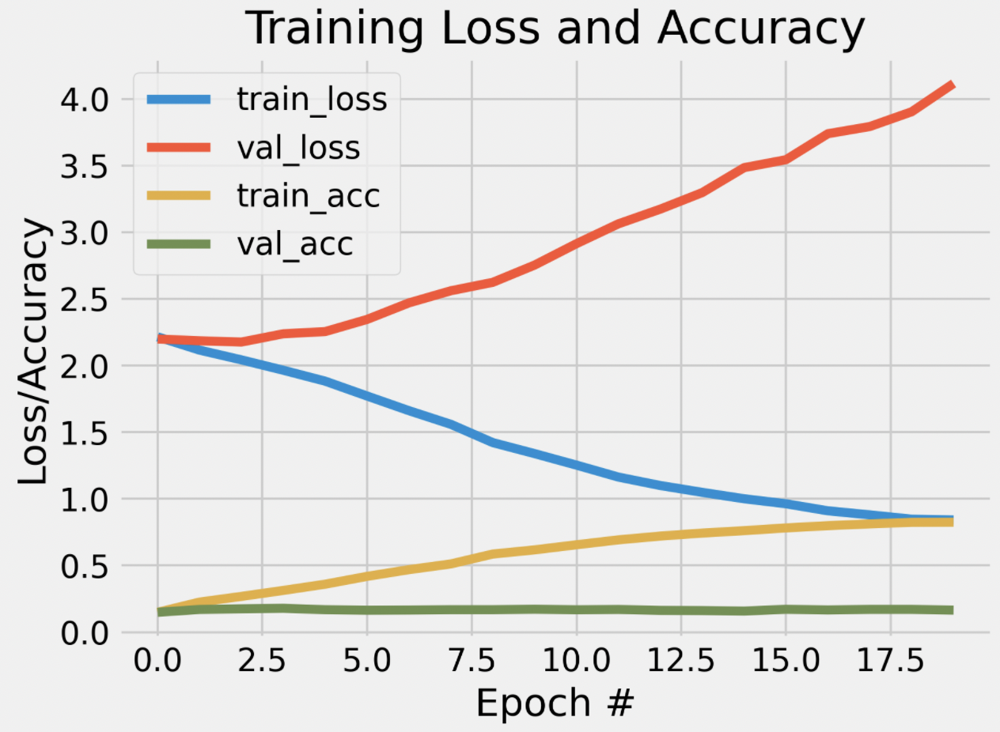

# Project 4: Text classification using Deep Learning
This project was developed as a solution to assignment 6 set by our teacher, Ross Deans Kristensens-McLachlan, during the course. A Github repository containing all of the code in relation to my solution to the assignment can be found here: 
https://github.com/frillecode/LanguageAnalytics2021/tree/main/src/project4

## Project description 
### Text classification using Deep Learning
In class this week, we've seen how deep learning models like CNNs can be used for text classification purposes. For your assignment this week, I want you to see how successfully you can use these kind of models to classify a specific kind of cultural data - scripts from the TV series Game of Thrones.

You can find the data here: https://www.kaggle.com/albenft/game-of-thrones-script-all-seasons

In particular, I want you to see how accurately you can model the relationship between each season and the lines spoken. That is to say - can you predict which season a line comes from? Or to phrase that another way, is dialogue a good predictor of season?

Start by making a baseline using a 'classical' ML solution such as CountVectorization + LogisticRegression and use this as a means of evaluating how well your model performs. Then you should try to come up with a solution which uses a DL model, such as the CNNs we went over in class.


## Methods
For this assignment, I analysed a [dataset](https://www.kaggle.com/albenft/game-of-thrones-script-all-seasons) consisting of scripts from all seasons of the TV-series, _Game of Thrones_. I want to investigate how accurately I can model the relationship between each season and the lines spoken using Deep Learning (DL). To do so, I want to create a Convolutional Neural Network model which attempt to predict which season a sentence comes from. 

To investigate how well I could train a DL model to predict the season based on sentences, I first created a logistic regression (LR) classification model to use as a baseline. I trained the LR model to predict the season of sentences based on a count-vector of the words in the sentences. Because the data was sparse, I scaled the data using the inbuilt MaxAbsScaler() from sklearn (dividing by max value for each feature to get values between -1 and 1), which is a solution suggested in the [scikit-learn documentation](https://scikit-learn.org/stable/modules/preprocessing.html). The amount of data for each season varied (with Season 2 having 3914 sentences and Season 6 having only  1466 sentences). To overcome this, I created a more balanced dataset based on 1000 samples from each season. To validate the results, I performed cross-validation to get average performance using different test-train splits. After running the script, a classification report and a confusion matrix can be found in the 'out'-folder along with the plots from the cross-validation. 

For the DL-model, a few different preprocessing steps were performed. First, a balanced dataset was created (same as for LR). Then, the labels were binarized and numerical representations of the texts were created using tensorflow.keras.Tokenizer(). The texts were padded to ensure equal length. The numerical representations of the texts were then transformed into dense, embedded representations to feed our model. I used pre-trained ```GloVe```-embeddings to create an embedding matrix. Word embeddings are mathematical vector-representations of words in an abstract space in which words that are closely related occupy close spatial locations (Karani, 2018). Using pre-trained word embeddings is a way of using transfer learning to inform our model of how words usually relate to one another, which could allow our model to make more accurate predictions without as much training.   

To this, I added a fully-connected layer with "ReLu"-activation function and L2 regularizer, a MaxPooling layer, a dense layer with "ReLu"-activation function and L2 regularizer, a dropout layer with rate 0.2, and finally, an output layer with 8 nodes to predict the 8 classes. Thus, we ended up with the following network architecture:

| Layer (type)  | Output Shape | Param # 
|--------|-----------| ------ |
embedding (Embedding) | (None, 1256, 50) | 280600  
conv1d (Conv1D) | (None, 1252, 128) | 32128 
global_max_pooling1d (Global | (None, 128) |  0  
dense (Dense)  | (None, 48)  | 6192
dropout (Dropout) | (None, 48)  | 0
dense_1 (Dense) | (None, 8) | 392  

_Total params: 323,312_  
_Trainable params: 38,712_  
_Non-trainable params: 280,600_  

The model was compiled using an Adam-optimizer and the loss-function "categorical_crossentropy". After running the script, a classification report and plot of the model as it learns can be found in the 'out'-folder. 


## Usage
The structure of the files belonging to this project is as follows:
```bash
LanguageAnalytics2021/  
├── data/ #data
│   └── project4/
│   │   └── glove/
│   │   │   └── *.txt
│   │   └── Game_of_Thrones_Script.csv 
├── src/ #scripts
│   └── project4/
│   │   └── out/  #results
│   │   └── LR_GOT.py
│   │   └── DL_GOT.py   
├── utils/  #utility functions 
│   └── *.py  
```

### Data

For this assignment, I used pretrained word embeddings from ```GloVe```. To run the script, these needs to be downloaded and placed in the data-folder. This can be done by running the following in the command-line:
```bash
$ cd LanguageAnalytics2021/data/project4
$ wget http://nlp.stanford.edu/data/glove.6B.zip
$ unzip -q glove.6B.zip
```

### Cloning repo and installing dependencies 
To run the script, I recommend cloning this repository and installing relevant dependencies in a virtual environment:  

```bash
$ git clone https://github.com/frillecode/LanguageAnalytics2021
$ cd LanguageAnalytics2021
$ bash ./create_venv.sh #use create_venv_win.sh for windows
```

If you run into issues with some libraries/modules not being installed correctly when creating the virtual environment, install these manually by running the following:  
```bash
$ cd LanguageAnalytics2021
$ source cds-lang/bin/activate
$ pip install {module_name}
$ deactivate
```

### Running scripts
After updating the repo (see above) and downloaded data, you can run the .py-files from the command-line by writing the following:
``` bash
$ cd LanguageAnalytics2021
$ source cds-lang/bin/activate
$ cd src/project5
$ python3 LR_GOT.py
$ python3 DL_GOT.py
```


For the DL-script it is possible to specify different optional arguments through the command-line. The arguments are optional and the script will run with default values if nothing is specified. The arguments you can parse are: 
``` bash
- "-e", "--epochs", required=False, type=int, default=20, help="int, number of epochs"
- "-l", "--lambda", required=False, type=float, default=0.001, help="float, lambda value for L2 regularization"   
- "-bs", "--batch_size", required=False, type=int, default=32, help="int, batch size"
- "-ed", "--embedding_dim", required=False, type=int, choices=[50,100,200,300], default=50, help="int, embedding size of pretrained GloVe embeddings (must be either: 50, 100, 200, or 300)"
``` 

For example, to run the script with 50 epochs, a batch size of 64, an embedding size of 100 run, and a lambda of 0.1:
``` bash
$ python3 DL_GOT.py -e 30 -bs 64 -ed 100 -l 0.1
```

You can get more information on the optional arguments that can be parsed by running:
``` bash
$ python3 DL_GOT.py --help
```

## Discussion of results
The resulting output-files from running the scripts can be found in 'out/'. 

The LR baseline model performed with a weighted average accuracy of 22% with f1-scores ranging between 0.14 and 0.28 indicating that the model differed quite a lot in how succesfully it predicted the different seasons. Looking at results from the cross-validation, it seems that the model fails to generalize to the validation data suggesting that it might suffer from a problem of overfitting. 

By comparison, the DL model performed with a weighted average accuracy of 17%. These results are from running the script with the default values of the arguments (epochs=20, batch_size=32, embedding_dim=50, lambda=0.001). I experimented with different values for the hyperparameters and tweaking of the network architecture, however, this did not change the performance of the model signifantly. When looking at the F1-scores for the different classes it seems that the model performs somewhat dissimilar when predicting the different classes - similarly to the LR model. Perhaps some seasons have more distinct features in the dialogue - for example, one could imagine that a season with a focus on fewer storylines/characters would have a more consistent dialogue and be easier for the model to predict. 

<p align="center">
    
  <p>


From the learning curves, we see that model minimizes loss on training data but not on the validation data - the training and validation curves follow each other for 2 epochs and then diverge. Because of the large difference in number of sentences between seasons, the balancing of the data resulted in exclusion of a lot of data. It might be that the model does not generalize very well because there is not enough data. Unfortunateley, it is not possible to gather more data in this case (unless George R. R. Martin suprises us all). 

Overall, the results suggest that neither of the models were successful in predicting the season of GOT based on the lines spoken. 


## References
Karani, D., (2018), "Introduction to Word Embeddings and Word2Vec", Towards Data Science, https://towardsdatascience.com/introduction-to-word-embedding-and-word2vec-652d0c2060fa
