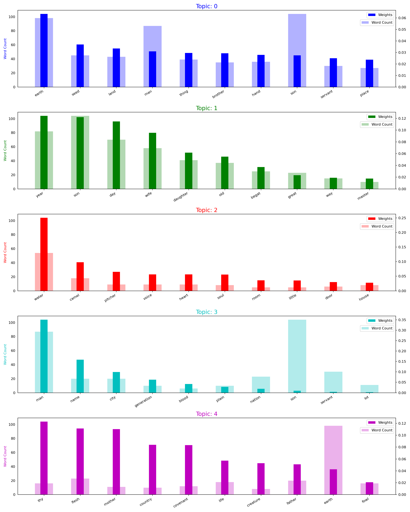

# Project 5: Topic Modelling on religious texts
This was a self-assigned project. A Github repository which contains all of the code in relation to my solution to the assignment can be found here: 
https://github.com/frillecode/LanguageAnalytics2021/tree/main/src/project5


## Contribution
This project was made in collaboration with Marie Damsgaard Mortensen. The work has been equally split. Apart from collaborating with me on data inspection, conceptual decisions, pipeline creation, and project discussions, Marie contributed with modifications of coherence and perplexity functions and gathering functions in a coherent script. Methods and results were also written in collaboration.

## Project description 
In this project, we aim to create a pipeline to investigate differences and similarities of topics and themes of five religious and philosophical texts. We want to do this by extracting structured information from the texts using Topic Modelling. 

We have downloaded a data set containing 5 religious and philosophical texts taken from the online book archive [Project Gutenberg](https://www.gutenberg.org/). The data set can be downloaded here: https://www.kaggle.com/tentotheminus9/religious-and-philosophical-texts. 

The 5 books are: 
- _The King James Bible_ (filename: 'pg10.txt')
- _The Quran_ (filename: 'pg2800.txt')
- _The Book of Mormon_ (filename: 'pg17.txt')
- _The Gospel of Buddha_ (filename: '35895-0.txt')
- _Meditations_ by Marcus Aurelius (filename: 'pg2680.txt')


## Methods
For this project, we created a Latent Dirichlet Allocation (LDA) model to perform topic-modelling. An LDA relies on the assumption that each document is represented by a distribution of a fixed number of topics, and each topic is a distribution of words (Ruchirawat, 2020). 

Some preprocessing steps were performed to prepare the data for analysis. First, we removed the beginning of the books containing an introduction to Project Gutenberg to only keep the content of the actual books. Then digits, most punctuation, and stop-words were removed. The text was split into individual sentences so that each sentence corresponds to a document in our Topic Model. We then created bigrams and trigrams based on words frequently appearing together, and performed lemmatization and pos-tagging using spaCy (Honnibal & Montani, 2017). Based on ‘part-of-speech’-tagging, we filtered words to keep only nouns and adjectives. As spaCy has a maximum of 1,000,000 characters per doc, we used the first 1,000,000 characters of each book. Lastly, a dictionary with an integer value id for each word and a corpus with a ‘bag-of-words'-model for all documents are returned. This corpus can then be fed into our model.  

The model was implemented in Python using [```gensim```](https://pypi.org/project/gensim/). We developed a topic-model where multiple parameters needed to be defined such as number of topics to cluster words and documents into along with alpha/beta values as prior probabilities of document/word per-topic distributions. We made both a manual selection and automatic approximation of the number of topics possible; one can either write the number of topics or let the script calculate coherence and perplexity scores and select the number of topics with either highest coherence score or lowest perplexity score. Tuning hyperparameters of alpha and beta involved testing low (0.001), medium (1) and high (10) values of each metric and their combinations (following [this guide](http://ethen8181.github.io/machine-learning/clustering/topic_model/LDA.html#:~:text=Understanding%20the%20role%20of%20LDA%20model%20hyperparameters,-Finally%2C%20we'll&text=alpha%20is%20a%20parameter%20that,word%20weights%20in%20each%20topic.)). While this did not seem to yield any significant changes in performance, beta was kept at a fixed, automatic prior and alpha at a fixed, asymmetric prior. In addition, different values for iterations, passes, and chunk sizes were tested in order to balance convergence and speed of topic distribution updates, and to see how this influenced the topics.   

From the resulting topic-term and document-topic probabilities obtained from the model, we extracted most probable words for each topic across the documents. To further inspect the importance and distribution of weights across words in the topics, we plotted every keyword’s overall frequency in the corpus combined with its weight in a specific topic (for the sake of simplicity of the overview of topics, this plot is only created if the number of topics is below 8). After running the script, these results will be saved in the 'out/'-folder under a filename related to the filename of the input text. 

  
## Usage
The structure of the files belonging to this project is as follows:  
```bash
LanguageAnalytics2021/  
├── data/ #data
│   └── project5/
│   │   └── pg10.txt #the Bible
│   │   └── pg2800.txt #the Quran
│   │   └── pg17.txt #Book of Mormon
│   │   └── pg2680.txt #Meditations
│   │   └── 35895-0.txt #Gospel of Buddha
├── src/ #script
│   └── project5/
│   │   └── out/  #results
│   │   └── religious_topics.py 
├── utils/  #utility functions 
│   └── *.py  
```


### Cloning repo and installing dependencies 
To run the script, I recommend cloning this repository and installing relevant dependencies in a virtual environment:  

```bash
$ git clone https://github.com/frillecode/LanguageAnalytics2021
$ cd LanguageAnalytics2021
$ bash ./create_venv.sh #use create_venv_win.sh for windows
```

The script utilizes the spaCy pipeline _en\_core\_web\_sm_, which needs to be downloaded to run the script:
```bash
$ cd LanguageAnalytics2021
$ source cds-lang/bin/activate
$ python -m spacy download en_core_web_sm
```

If you run into issues with some libraries/modules not being installed correctly when creating the virtual environment, install these manually by running the following:  
```bash
$ cd LanguageAnalytics2021
$ source cds-lang/bin/activate
$ pip install {module_name}
$ deactivate
```

### Running scripts
After updating the repo (see above), you can run the .py-files from the command-line by writing the following:
``` bash
$ cd LanguageAnalytics2021
$ source cds-lang/bin/activate
$ cd src/project5
$ python3 religious_topics.py
```

It is possible to specify different optional arguments for the script through the command-line. The arguments are optional and the script will run with default values if nothing is specified. The arguments you can parse are: 
``` bash
- '-f','--filename' #filename of input text [default: "pg10.txt"]
- '-o','--outpath' #path for saving results [default: "out"]
- '-n','--num_topics' #number of topics [default: 5]
- '-m','--metric' #metrics to optimize for in compute_metrics() (overwrites num_topics if argument is passed) [default: None]
``` 

You can get more information on the optional arguments that can be parsed by running:
``` bash
$ python3 religious_topics.py --help
```

## Discussion of results
Currently, you can see results from running the script on all books with 5 topics in the 'out/'-folder. Here, you see the results of running of the King James Bible ('pg10.txt'): 

<p align="center">
    
  <p>

We see certain related words in topics - for example "earth", "place", "land" in topic 0, "house", "door", "room" in topic 2, and "daughter", "wife", "son" in topic 1. However, looking at the rest of the words in these topics, the topics are not very coherent, and several of the words also occur in other topics. This seems to be a general trend across the different books. For the Gospel of Buddha ('35895-0.txt'), topic 4 seems to contain words related to ethics and moral, e.g. "good", "evil", "deed", and "right" - while also containing words such as "food" and "man". These words could be related in the context of a religious text, however, the topics seem very general and indistinguishable from each other. Because the topics were not clearly segregated into specific themes, it was difficult to extract meaningful information about potential differences and similarities between the books based on these results. Despite tweaking of both preprocessing steps, hyperparameters, and number of topics, we did not manage to find more meaningful results than what is presented in the current results.  

A few issues arise when attempting to extract meaningful information from religious texts using topic-modelling. In our case, a corpus was made up of only one text/book meaning that we had to divide the text up into documents. In such religious/philosophical texts different sections might be whole stories of their own rather than follow a narrative in the sense that many other books do. A concern was, therefore, to automatically split the books into meaningful chunks in a way that was generalizable across all books. Another issue lies in the available language tools to support such an analysis. As the _en\_core\_web\_sm_ model from spaCy has been trained on written web text (blogs, news, comment) (Honnibal & Montani, 2017), it might not be as sensitive towards historical text data in which the vocabulary is different from what is used on websites.     

Furthermore, one could imagine that in these religious texts, many of the same words are used throughout the text in different contexts (e.g. "man", "goat", "son") and that some words carry a more abstract meaning - for example when used in metaphors, anecdotes, or as symbols. Thus, is might be difficult to assign certain words to certain topics, and it might be difficult to extract something meaningful from the clustering of words in topics without close reading and more background knowledge of the content of the texts. 

Combining this type of distant (topic-modelling) and close reading in topic modelling can in some cases yield very strong results, however, in this case it seems to require more time and expertise to extract meaningful topics and elements of each religious text. Despite this, we have developed a script and pipeline that can, with quite few modifications, be applied to new texts.


## References

Honnibal, M., & Montani, I. (2017). "spaCy 2: Natural language understanding with Bloom embeddings, convolutional neural networks and incremental parsing"


Ruchirawat, N., (2020), "6 Tips for Interpretable Topic Models", towards data science, 
https://towardsdatascience.com/6-tips-to-optimize-an-nlp-topic-model-for-interpretability-20742f3047e2, [Visited May 26 2021]